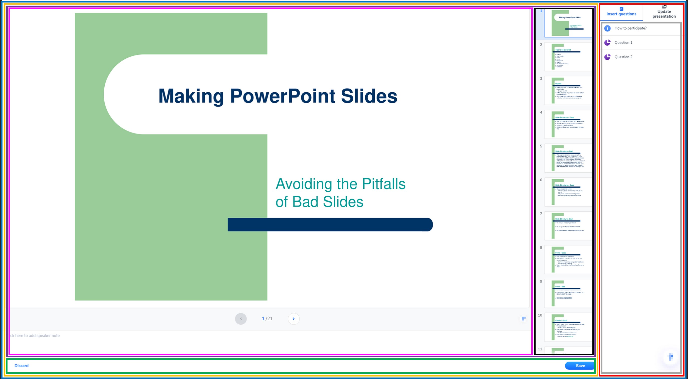
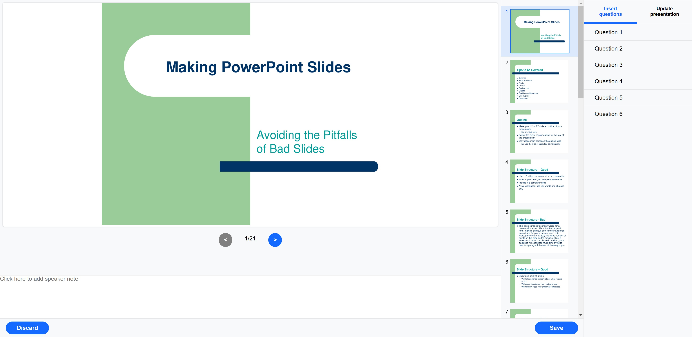
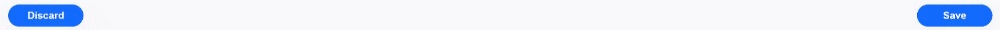

# Presenatation configuration screen

An interface where the user can view his presentation, modify it, add notes & questions.


## Installation

Install the project with npm :

```bash
  // Install all dependencies.
  npm install

  // Run the project.
  npm start
```

## Libraries used

| Library      | Version | Description                           |
|:-------------|:--------|:--------------------------------------|
| `react`      | ^18.2.0 | React core code                       |
| `react-dom`  | ^18.2.0 | Package provides DOM-specific methods |
| `@babel/core`| ^7.20.2 | Transpile ECMAScript 2015+ code into compatible version of JavaScript in current and older browsers or environments. |
| `sass`       | ^1.56.1 | Pre-processor extension to CSS        |


## Components list
React components are split as shown in the following screenshot:


Here is some information about these components :
| Component              | Description                                              | State | Props  |
|:-----------------------|:---------------------------------------------------------|:--------|:--------------------------------------|
| [App.jsx](./src/App.jsx)              | Contains all main page content.                          |n/a|n/a|
| [MainContainer.jsx](./src/components/MainContainer/MainContainer.jsx)    | Contains current slide, slides list and actions bar.     |n/a|n/a|
| [SlidesPresenation.jsx](./src/components/SlidesPresentation/SlidesPresentation.jsx)| Contains current slide and action bar.                   |{ slidesList: array, currentSlide: object } |n/a|
| [CurrentSlide.jsx](./src/components/SlidesPresentation/CurrentSlide/CurrentSlide.jsx)     | Contains current slide, pagination bloc and speaker note.|{ note: string }|{ slide: object, slidesNumber: number, changeSlide: func, setSlides: func }|
| [ActionBar.jsx](./src/components/ActionsBar/ActionsBar.jsx)        | Contains 'Discard' and 'Save' buttons.                   |n/a|n/a|
| [SlidesList.jsx](./src/components/SlidesPresentation/SlidesList/SlidesList.jsx)       | Contains scrollable slides list.                         |n/a|{ slides: array, currentSlideId: number, changeSlide: func }|
| [Sidebar.jsx](./src/components/Sidebar/SideBar.jsx)          | Contains tabs menu, questions and presentations blocs.   |{ currentTab: string }|n/a|
| [Questions.jsx](./src/components/Sidebar/Questions/Questions.jsx)        | Contains questions list.                                 |n/a|n/a|
| [Presenations.jsx](./src/components/Sidebar/Presentations/Presentations.jsx)     | Contains presentations list.                             |n/a|n/a|


## Features/Screenshots
Here is the rendering of the main page :


Through this main page, here are some functionnalities :
- Sidebar : where a menu is displayed to list questions and presentations.

  


- Slides list : all presentation slides are displayed here. The user can click any slide to display it.


- Current slide : the current slide, number and speaker notes are displayed here. The user can fill notes or click on arrow buttons to go the next or previous slide.


- Actions bar : footer bloc which contains 'Save' and 'Discard' buttons.


The page fits screen size :


## Bugs/limitations
Functionnal side :
- Add paddings on speaker note textarea field to avoid that the text is too close to the block.
- At the sidebar menu, the onclick event is only when cursor is on the text but not on the whole block.
- The icons is not presents in questions and presentations lists.

Code side :
- Add relative path when importing files.
- Create File which contains all texts displayed on the interface.

## Next steps

- Allow user to zoom in/out on the slide.
- Make slidebar and slides list block resizable.
- Add ability to undo the last action with "arrow" buttons.


## Author

[@BHocine21](https://www.github.com/octokatherine)

[](https://www.linkedin.com/in/hocine-bouhlala-407025132/)

