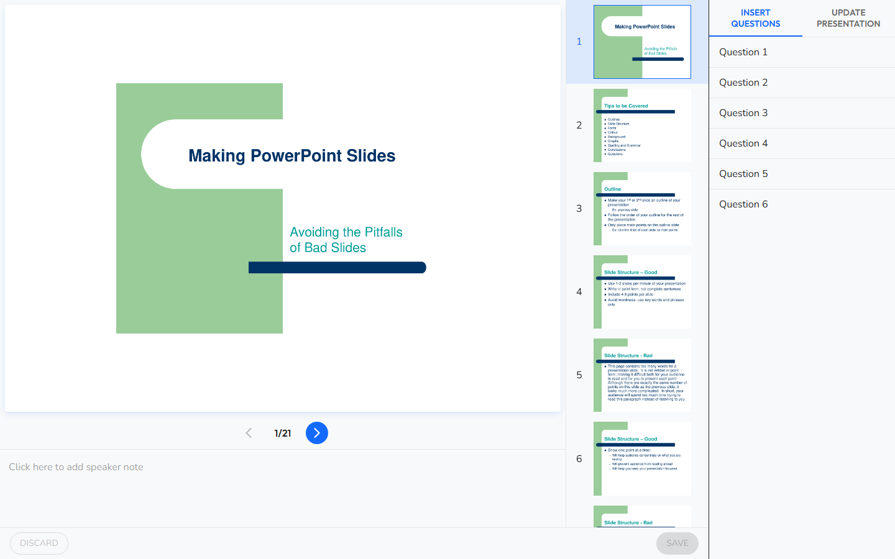
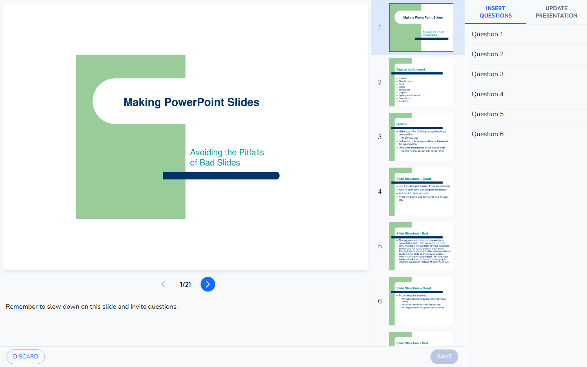
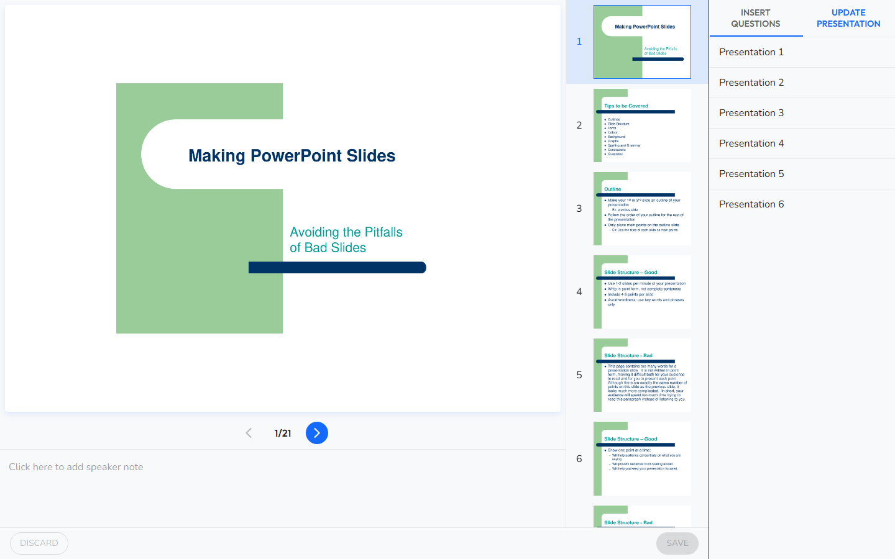
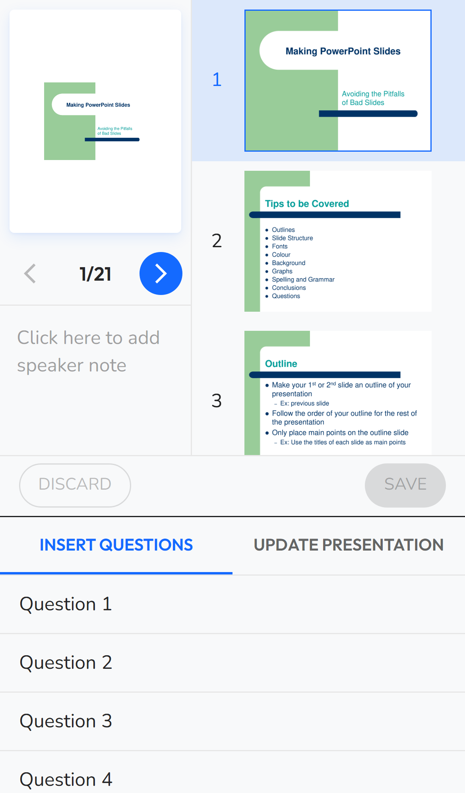

# Presentation configuration screen

An interface where the user can view a presentation, navigate its slides, add speaker notes, and browse questions/presentations from a sidebar.

See [ARCHITECTURE.md](./ARCHITECTURE.md) for the stack, folder structure, and state management details.

## Installation

```bash
pnpm install
pnpm dev
```

## Available scripts

| Script                                                 | Description                                       |
| :----------------------------------------------------- | :------------------------------------------------ |
| `pnpm dev`                                             | Starts the Vite dev server                        |
| `pnpm build`                                           | Type-checks and builds the production bundle      |
| `pnpm preview`                                         | Serves the production build locally               |
| `pnpm typecheck`                                       | Runs the TypeScript compiler with no emit         |
| `pnpm lint` / `pnpm lint:fix`                          | Lints the codebase with ESLint                    |
| `pnpm format` / `pnpm format:check`                    | Formats / checks formatting with Prettier         |
| `pnpm spellcheck`                                      | Spell-checks source files with cspell             |
| `pnpm test` / `pnpm test:watch` / `pnpm test:coverage` | Runs unit tests with Jest + React Testing Library |
| `pnpm e2e`                                             | Runs the Playwright end-to-end suite              |

## Features

- **Slide navigation**: browse the 21 slides via the pagination buttons or by clicking a thumbnail in the slides list.
- **Speaker notes**: edit a note for the current slide; it is buffered locally until the field loses focus.
- **Save / Discard**: edited notes are persisted to `localStorage` on save, or reverted to the last saved state on discard.
- **Sidebar**: switch between "Insert questions" and "Update presentation" tabs (mock data).
- **Responsive**: the layout stacks vertically on mobile/tablet and switches to a side-by-side layout on desktop.

### Desktop



Editing a speaker note enables the Save/Discard actions:



The sidebar's "Update presentation" tab:



### Mobile



## Known limitations

- Questions and presentations in the sidebar are static mock data — there is no editing capability on these lists.
- There is no backend: persistence is limited to speaker notes in `localStorage`.

## Author

[@BHocine21](https://github.com/BHocine21)

[](https://www.linkedin.com/in/hocine-bouhlala-407025132/)
